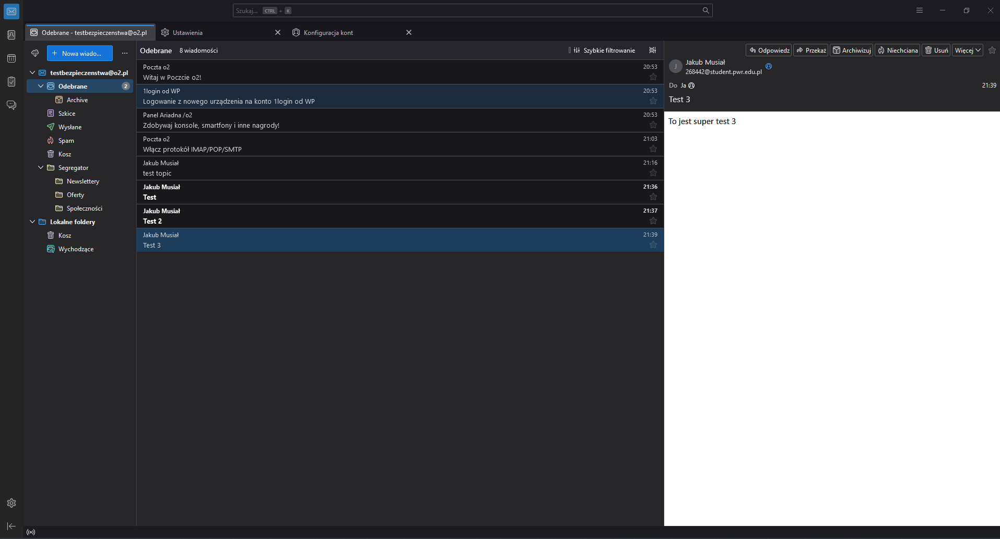
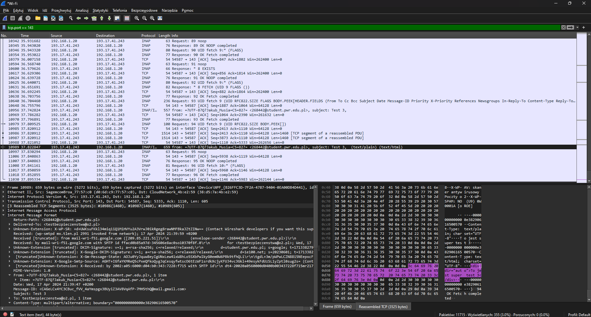

# Bezpieczeństwo komputerowe - [lab3](sec-lab3.pdf)

## Zadanie 1

1. Na potrzeby listy zadań stworzona mail: `testbezpieczenstwa@o2.pl`

2. Konfiguracja klienta Thunderbird:

    Ustawienia -> Ustawienia kont -> Konfiguracja serwera

    * Nazwa serwera: `poczta.o2.pl`
    * Port: `110`
    * Bezpieczeństwo połączenia: `Bez szyfrowania`
    * Metoda uwierzytelniania: `Hasło przesyłane otwartym tekstem`

3. Wysłano maila z maila studenckiego.
4. Użyto sugerowanego programu - wireshark.
5. Odebrano testowego maila w kliencie Thunderbird.

6. Przechwycone dane:

    * nadawca,
    * temat maila,
    * treść maila,

    czyli prkatycznie wszystkie wrażliwe informacje, które były do przechwycenia.

    <div align="center">

    

    

    <div align="left">

7. SMTP = Simple Mail Transfer Protocol

    Czysty SMTP nie przewiduje szyfrowania wiadomości, jednak jego rozszrzecznia takie jak SMPTS (SMTP over SSL/TLS) albo ESMTP (Extended SMTP) już tak.

8. Czy SSL/TSL gwarantuje bezpieczeństwo wiadomości?

    Wybór protokołów SSL/TLS w programie pocztowym zapewnia zabezpieczenie komunikacji jedynie w trakcie transmisji między klientem poczty użytkownika a serwerem pocztowym. Po dotarciu na serwer docelowy i zapisaniu tam wiadomości, dalsze zabezpieczenie zależy od sposobu zarządzania danymi przez dostawcę usług pocztowych.

9. Metody zapewnienia poufności wiadomości wysyłanych mailem:

    * **Szyfrowanie End-to-End**
    * Używanie protokołów komunikacyjnych takich jak SSL/TSL
    * Bezpieczne hasła i 2FA
    * Ostrzeżenia przed phishingiem

10. Zabezpieczenia Proton Mail:

    * Szyfrowanie End-to-End: wiadomość szyfrowana u nadawcy i pozostaje zaszyfrowana aż do odbiorcy - nawet Proton Mail nie ma dostępu do treści wiadomości
    * Bezpieczne połączenia: Proton Mail korzysta z protokołów SLL/TLS by zapewnić bezpieczną transmisję danych
    * 2FA
    * Ochrona hasłem: możliwość ustawienia haseł oraz dat wygasania dla wiadomości email
    * Ochrona przed phishingiem: ProtonMail implementuje mechanizmy ochrony przed phishingiem, aby ostrzec użytkowników przed podejrzanymi wiadomościami e-mail, które mogą być próbami oszustwa (np. przez używanie aliasów "zakrywających" prawdziwy adres email przy tworzeniu kont na różnych platformach)
    * Open-source: Proton mail udostępnia kod źródłowy aplikacji webowych, desktopowych i mobilnych

<br/>
<br/>

## Zadanie 2

SPF = Sender Policy Framework
DKIM = Domain Keys Identified Mail
DMARC = Domain-based Message Authentication, Reporting and Conformance

Sprawdzanie SPF, DKIM, DMARC:
* https://mxtoolbox.com/SuperTool.aspx
* Za pomocą dig:
    * SPF: `dig txt example.com | grep spf`

        Możliwy status:
        * pass = dany serwer pocztowy mógł wysłać wiadomość w imieniu danej domeny
        * none = polityka spf nie istnieje (w rekordach DNS nie istnieje rekord TXT rozpoczynający się od `v=spf1`)
        * fail = serwer nadawcy nie znajduje się w polityce SPF danej domeny (ends with `-all`)
        * softfail = serwer nadawcy nie znajduje się w polityce SPF danej domeny, ale w polityce zaznaczono, że jest ona w fazie przejściowej (ends with `~all`)
        * neutral = nie sugeruj, polityka zdefiniowana, ale administrator nie chce weryfikowania serwera pocztowego nadawcy (ends with `?all`)

    * DKIM: `dig txt selector._domainkey.example.com | grep dkim`

        Pola:
        * `a=` - zestaw algorytmów
        * `d=` - domena, którą należy odpytać o klucz publiczny do weryfikacji podpisu
        * `s=` - selektor wskazujący, który z opublikowanych kluczy publicznych ma być użyty
        * `h=` - które pola nagłówka zostały podpisane
        * `bh=` - wartość hasha
        * `b=` - podpis

        Status: `pass` albo `fail`

    * DMARC: `dig txt _dmarc.example.com | grep dmarc`

        DMARC to dopełnienie SPF i DKIM (zestaw reguł budowanych na bazie SPF i DKIM pozwalających zdecydować, czy wiadomość faktycznie przyszła od wysyłającego za którego się podaje)

        Sprawdzenia:
        * SPF - czy dla otrzymanej wiadomości reguła SPF przeszła sprawdzenia oraz czy RFC5321.MailFrom zgadza się z RFC5322.From
        * DKIM - czy otrzymana wiadomość jest poprawnie podpisana wg. DKIM oraz czy wartość w polu d= nagłówka DKIM-signature zgadza się z RFC5322.From

        ```
        DMARC authentication pass =
            (SPF authentication pass AND SPF identifier alignment) OR
            (DKIM authentication pass AND DKIM identifier alignment)
        ```

        Jeżeli DMARC zwraca `fail`, to pole nadawca w polu `p=` definiuje, co należy zrobić:
        * `none` - dostarcz wiadomość
        * `quarantine` - dostarcz wiadomość do folderu SPAM
        * `reject` - odrzuć wiadomość

* Czy jeśli SPF = DKIM = DMARC = pass, to wiadomość może trafić do SPAM?

    Tak - ze względu na inne czynniki takie jak zawartość wiadomości, reputacja nadawcy, itd...

* Czy jeśli SPF = DKIM = DMARC = pass, to wiadomość może zawierać złośliwy link?

    Tak - mechanizmy uwierzytelniania nie gwarantują, że wiadomość jest całkowicie bezpieczna
